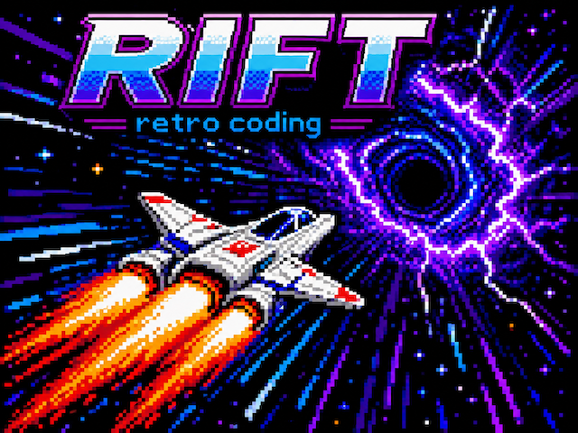

# Rift

Rift is a statically typed language written in C and targeted at the ZX Next retro system.

Its designed so that you develop on your pc/laptop and deploy to an emulator or real hardware.
A Rift program can also be directly run locally.



## Language at a glance

Rift provides:

- Scalar types: `int`, `byte`, `word`, `dword`, `float`, `boolean`, `char`, and `string`
- Dynamic and fixed-size arrays
- Records, enums, unions, and modules
- Functions, methods, loops, and `match`
- C and Z80 assembly embed blocks
- A runtime library for strings, arrays, input, graphics, sound, and ZX Spectrum Next access
- Automatic memory allocation, reclaimed automatically when its final reference dies

For example:

```rift
sub main() {
  int[] numbers;

  for i := 1 to 3 {
    append(numbers, i);
  }

  print(toString(length(numbers)));
}
```

Fixed arrays grow their logical length through sequential assignment. Writing
at `length(array)` initializes the next slot, while writing beyond that index
is rejected; skipped capacity is never exposed as initialized elements.

#### Embed and call C and Assembly code directly inside rift code
```rift
  @embed c
  int square(int x) { return x * x; }
  @end c

  sub main() {
    print(toString(square(7)));
  }
```

#### enums
```rift
  enum Direction { North, South, East, West }
```

#### Records (with methods)
```rift
  record Point { 
    int x, 
    int y 
  }
  sub Point.move(int dx, int dy) returns Point {
    return { x := this.x + dx, y := this.y + dy };
  }


  sub main() {
    Point start := { x := 2, y := 3 };
    Point end := start.move(1, -1);
  }

```

#### Organise code into modules

```rift
  module Scoreboard;
  int score;

  sub Scoreboard.add(int points) {
    this.score := this.score + points;
  }
```

#### Type-level methods

Use `static sub Type.method(...)` for behaviour owned by a type rather than an
instance. The declaration receives no implicit `this`; callers use the type
name directly.

```rift
  module Sprites;

  static sub Sprites.hideall() {
    // component-wide work
  }

  sub main() {
    Sprites.hideall();
  }
```

Standard interfaces are preloaded by the compiler, so applications do not
repeat their declarations. Sprite patterns are compiler-only bindings, while
each `Sprite` value is a one-byte hardware-slot handle:

```rift
SpritePattern playerPattern :=
  SpritePattern.load("assets/player.spr");

sub main() {
  Sprite player := Sprite(1);
  player.position(10, 20);
  player.frame(playerPattern, 0);
  player.show();
  player.hide();
  Sprite.hideall();
}
```

`SpritePattern.load(path)` defaults to 4bpp; pass literal `8` as its second
argument for 8bpp input. This intentionally replaces both the earlier
`asset sprite4` declaration and the combined five-argument `Sprite.show` call.
See [the sprite and asset contract](docs/sprites-and-assets.md) for raw formats,
hardware ownership, exact memory costs, and test evidence.

Runtime components are selected from resolved calls through
`src/lib/components.manifest`; the same dependency closure drives host and ZX
Next builds.

#### Tagged unions and match
```rift
  union Token {
    // a Token instance is allowed to be *one* of these:
    int Number,
    string Name,
    char Operator,
    End
  }

  Token token := Number(42);

  match token {
    Number: print("a number");
    Name: print("a name");
    Operator: print("an operator");
    End: print("the end");
  }
```


## Requirements

I'll be reducing the prerequisite requirements in the future (hopefully to nothing!), but for now to compile Rift code
you need:
- `make`
- `gcc`
- [Z88DK](https://z88dk.org/) with `zcc` available on your `PATH`

ZX Spectrum Next `.zxn` programs are the default build target and use Z88DK.
Native programs use GCC when selected with `--target=gcc`.
`SpritePattern` build inputs are generated directly by the compiler; the build
has no Perl or external asset-packing dependency.

## Build the compiler

```bash
make
```

This creates `riftc`, the Rift-to-C compiler, and `rift`, the native build
driver.

## Write and build a program

Create `hello.rift`:

```rift
sub main() {
  print("Hello, Rift!\n");
}
```

`.rift` is the canonical source extension. The shorter `.rft` extension is
also accepted by the compiler, driver, and test tooling.

Build it for the default ZX Spectrum Next target:

```bash
./rift hello.rift
```

The `rift` driver translates the source to C, compiles it with Z88DK, and
creates `hello.zxn`.

To build and run it as a native host program instead:

```bash
./rift run --target=gcc hello.rift
```

This creates and runs `hello.exe`.

To choose an output name:

```bash
./rift hello.rift hello
```

To retain build intermediates for inspection:

```bash
./rift hello.rift --debug
```

Normal builds keep generated C, component sidecars, maps, and target-toolchain
files inside a private `/tmp/rift-build-*` workspace and remove it after the
final artifact is published. `--debug` retains that workspace and prints its
location.

## Targets

### Host

Build a native executable with GCC:

```bash
./rift hello.rift --target=gcc
```

### ZX Spectrum Next

Build a `.zxn` program with Z88DK:

```bash
./rift hello.rift
# or explicitly:
./rift hello.rift --target=zxn
```

Rift uses Z88DK’s SDCC backend for this target. Z88DK creates a NEX-format
image internally; the driver publishes the final program with Rift's `.zxn`
extension.


## Test

Run the host test suite:

```bash
./run_tests.sh
```

The test harness selects `--target=gcc` explicitly so it can execute each
compiled program locally.

Run one test while working on a feature:

```bash
./run_tests.sh test/array_test.rift
```

Tests are Rift programs in `test/`. Most include `test/Assert.rift` and print `PASS:` or `FAIL:` markers for the test runner.

## Project layout

```text
src/        Compiler: lexer, parser, type checker, and C generator
src/lib/    Runtime library and target support
test/       Rift regression tests
docs/       Language and implementation notes
wikiroot/   Maintainer knowledge wiki
rift        Build driver for Rift programs
riftc       Generated compiler binary
```

## Development

```bash
make
./run_tests.sh
```

Use `make clean` to remove build output and `riftc`.

The host target has the broadest test coverage. The ZX Spectrum Next target needs Z88DK; compile it separately when a change touches target-specific code. `enum_test.rift` is currently known to fail on that target because of an SDCC enum syntax incompatibility.

## Further reading

The project wiki in `wikiroot/` describes the compiler pipeline, language syntax, runtime, and target support. Start with `wikiroot/README.md`.
